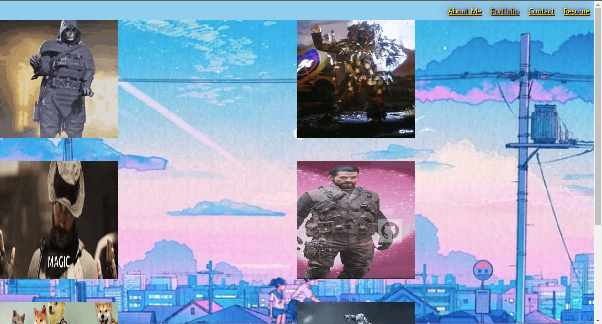
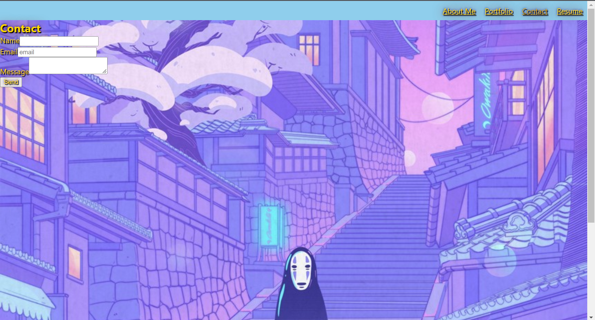
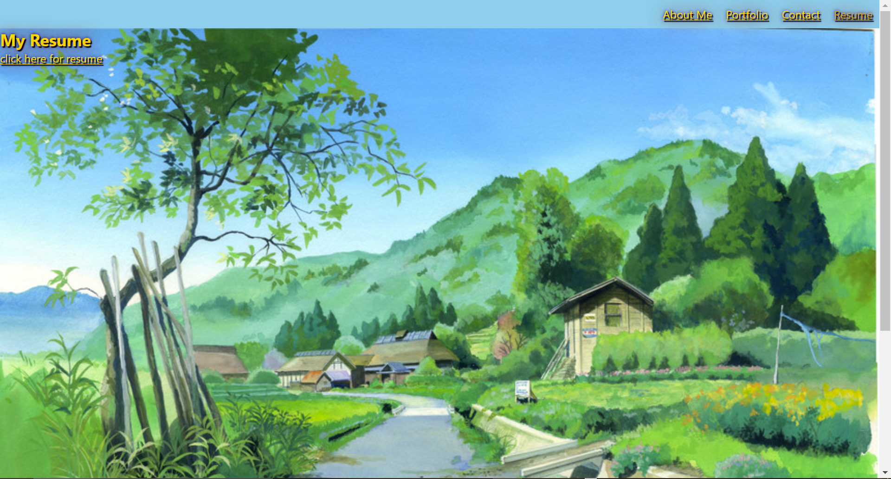

# REACT Portfolio

## Deployable Link
https://elduderino23.github.io/apparao-vasu-react-portfolio/

## Goal
The task was to build a portfolio with an about me section, portfolio section with both links to websites and GitHub Repos for each website in the portfolio, a contact page that validates an email chain in the input and changes to valid or invalid depending on what input is submitted, and a resume section that has a link to download a resume when the user clicks on the download resume link. Each selected section also had to highlight what the user clicked on so for example if the user clicked on the about me section then the the about me section in the nav bar would highlight based on selection.

## Technology Use
  - Javascript
  - REACT
  - VS Code
  - Git Bash 
  - GitHub

## Execution
Since there was no code given, the first step was to download the REACT app via `create-react-app`. After the following was downloaded, each section of the website needed its own component javascript file in order for the different parts of the website to work. For example, Navbar.js was needed to for the navbar, Contact.js was needed for the Contact section, Portfolio.js was needed for the Portfolio section, Resume.js was needed for the Resume section, AboutMe.js was needed for the About Me section, and Footer.js was needed for the social media links in the footer at the bottom of the webpage. The following codes are for each component javascript file:

AboutMe.js code:
```Javascript
import React from 'react';
import City from '../images background/City.jpg'
import Portrait from '../images background/Portrait.jpg'
const styles = {
  sectionStyles: {
    background: `url(${City})`,
    height: "900px",
    backgroundSize: "cover"
  },
  textStyle: {
    color: "gold",
    textShadow: "2px 2px 1px black, 0 0 25px maroon, 0 0 5px darkblue",
    backgroundColor: "#00009c8b"
  },
  
};


function AboutMe() {
  return (
    <section style={styles.sectionStyles}>
      <h2 className= "AboutMe"style={styles.textStyle}>About Me</h2>
      </img>
      <p style={styles.textStyle}>
      My name is Vasu Apparao and I am an aspiring full stack web developer with a background in 2D Animation and Japanese language. 
      I work well in teams and great at completing tasks both large and small. 
      I am always proactive in solving problems and continually in search of new problems to solve in the ever changing world of web development. 
      I am cum laude graduate of California State University Monterey Bay, a recipient of the Louis Armstrong Jazz Award and a also an Eagle Scout from Troop 132. 
      I am consistantly honing my skills in HTML, CSS, JavaScript, Node, SQL, MongoDB, and React. 
      Outside of coding, I am engaged in creative endeavors in drawing, video editing, and painting.
      </p>
    </section>
  );
}

export default AboutMe;
```


Contact.js code:
```Javascript
import { React, useState} from 'react';
import { validEmail } from '../utils/helper';
import Stairs from '../images background/Stairs.jpg'
const styles = {
  contactStyles: {
    background: `url(${Stairs})`,
    height: "900px",
    backgroundSize: "cover",
    backgroundPosition: "center",
  },
  textStyle: {
    color: "gold",
    textShadow: "2px 2px 1px black, 0 0 25px maroon, 0 0 5px darkblue"
  },
  
};
const ContactForm = () => {
  const [email, setEmail] = useState('');
  const [formState] = useState('Send')
  const [errorMessage, setErrorMessage] = useState('');

    const handleInputChange = (e) => {
      const { target } = e;
      const inputType = target.name;
      const inputValue = target.value;
  
      if (inputType === 'email') {
        setEmail(inputValue);
      } else {
        return false;
      }
    };
  
    const handleFormSubmit = (e) => {
      e.preventDefault();
  
      if (!validEmail(email)) {
        setErrorMessage('Email is invalid');
        return;
      
      }else{
        setErrorMessage('email submitted')
        return
      }
  
  }

  
  return (
   <section style={styles.contactStyles}>
     <div className="container mt-5">
      <h2 className="mb-3 ContactMe"style={styles.textStyle}>Contact</h2>
      <form onSubmit={handleFormSubmit}>
        <div className="mb-3">
          <label className="form-label" htmlFor="name" style={styles.textStyle}>
            Name
          </label>
          <input className="form-control" type="text" id="name"/>
        </div>
        <div className="mb-3">
          <label className="form-label" htmlFor="email" style={styles.textStyle}>
            Email
          </label>
          <input className="form-control" type="email" id="email" required value={email}
          name="email"
          onChange={handleInputChange}
          placeholder="email" />
        </div>
        <div className="mb-3">
          <label className="form-label" htmlFor="message" style={styles.textStyle}>
            Message
          </label>
          <textarea className="form-control" id="message" required />
        </div>
        <button className="btn btn-danger" type="submit" style={styles.textStyle} onClick={handleFormSubmit}>
          {formState}
        </button>
      </form>
      {errorMessage && (
        <div>
          <p className="error-text">{errorMessage}</p>
        </div>
      )}
    </div>
   </section>
  )
}
export default ContactForm
```


Footer.js code:
```Javascript
import React from 'react';

const styles = {
  navbarStyle: {
    background: 'skyblue',
    justifyContent: 'flex-end',
    display: 'flex'
  },
  linkStyle:{
    margin: '10px',
    color: "gold",
    textShadow: "2px 2px 1px black, 0 0 25px maroon, 0 0 5px darkblue"
  }
};


function Footer() {
  return (
    <nav style={styles.navbarStyle}>
      <a href="https://www.linkedin.com/in/vasu-apparao-312b1513b/"style={styles.linkStyle}>LinkedIn</a>
      <a href="https://github.com/Elduderino23"style={styles.linkStyle}>GithHub</a>
      <a href="https://medium.com/@vasutamirisaapparao"style={styles.linkStyle}>Medium</a>
    </nav>
  );
}

export default Footer;
```


Navbar.js code:
```Javascript
import React from 'react';

const styles = {
  navbarStyle: {
    background: 'skyblue',
    justifyContent: 'flex-end',
    display: 'flex'
  },
  activePage:{
    margin: '10px',
    color: "goldenrod",
    textShadow: "2px 2px 1px black, 0 0 25px maroon, 0 0 5px darkblue",
  },
};


function Navbar({setCurrentPage, currentPage}) {
  return (
    <nav style={styles.navbarStyle}>
      <a href="#"style={currentPage == "about"?styles.activePage: null}className="linkStyle"onClick={()=>{setCurrentPage("about")}}>About Me</a>
      <a href="#"style={currentPage == "portfolio"?styles.activePage: null}className="linkStyle"onClick={()=>{setCurrentPage("portfolio")}}>Portfolio</a>
      <a href="#"style={currentPage == "contact"?styles.activePage: null}className="linkStyle"onClick={()=>{setCurrentPage("contact")}}>Contact</a>
      <a href="#"style={currentPage == "resume"?styles.activePage: null}className="linkStyle"onClick={()=>{setCurrentPage("resume")}}>Resume</a>
    </nav>
  );
}

export default Navbar;
```


Portfolio.js code:
```Javascript
import React from 'react';
import Bike from '../images background/Bike.jpg'
import GitHub from '../images background/GitHub.png'
const styles = {
  sectionStyles: {
    background: `url(${Bike})`,
    height: "900px",
    backgroundSize: "cover",
    backgroundPosition: "center",
  },
  imageStyles:{
    width: "250px",
    height: "250px",
  },
  gitHubStyles:{
    background: `url(${GitHub})`,
    width: "50px",
    height: "50px",
    marginRight: "300px",
  },
  textStyle: {
    color: "gold",
    textShadow: "2px 2px 1px black, 0 0 25px maroon, 0 0 5px darkblue"
  },

};


function Portfolio() {
  return (
    <section style={styles.sectionStyles} className="Websites">
    <div className="gif_1">
      <a href="https://elduderino23.github.io/apparao_vasu_password_generator/">
        
        <div className="gif_1_middle">
          <div className="text">Password Generator</div>
        </div>
      </a>
    </div>
    <div className="gif_1">
    <a href="https://github.com/Elduderino23/apparao_vasu_password_generator">
        <div className="gif_1_middle">
        
        </div>
      </a> 
    </div>

    <div className="gif_1">
      <a href="https://elduderino23.github.io/horiseon-accessibility-rework/">
        
        <div className="gif_1_middle">
          <div className="text">Horiseon</div>
        </div>
      </a>
    </div>
    <div className="gif_1">
    <a href="https://github.com/Elduderino23/horiseon-accessibility-rework">
        <div className="gif_1_middle">
        
        </div>
      </a> 
    </div>

    <div className="gif_1">
    <a href="https://turtle2001.github.io/Kronos-StatIM/">
        
        <div className="gif_1_middle">
          <div className="text">KronosStatim</div>
        </div>
      </a>
    </div>
    <div className="gif_1">
    <a href="https://github.com/turtle2001/Kronos-StatIM">
        <div className="gif_1_middle">
        
        </div>
      </a>
    </div>

    <div className="gif_1">
    <a href="https://apparao-vasu-pwa.herokuapp.com/">
        
        <div className="gif_1_middle">
          <div className="text">PWA</div>
        </div>
      </a>
    </div>
    <div className="gif_1">
    <a href="https://github.com/Elduderino23/apparao-vasu-pwa">
        <div className="gif_1_middle">
        
        </div>
      </a>
    </div>

    <div className="gif_1">
    <a href="https://elduderino23.github.io/apparao-vasu-calender/">
        
        <div className="gif_1_middle">
          <div className="text">Calendar</div>
          </div>
      </a>
    </div>
    <div className="gif_1">
    <a href="https://github.com/Elduderino23/apparao-vasu-calender">
        <div className="gif_1_middle">
        
        </div>
      </a>
    </div>

    <div className="gif_1">
    <a href="https://elduderino23.github.io/apparao-vasu-weather/">
        
        <div className="gif_1_middle">
          <div className="text">Weather</div>
        </div>
      </a>
    </div>
    <div className="gif_1">
    <a href="https://github.com/Elduderino23/apparao-vasu-weather">
        <div className="gif_1_middle">
        
        </div>
      </a>
    </div>

    </section>
  );
}


export default Portfolio;

```


Resume.js code:
```Javascript
import React from 'react';
import Farmland from '../images background/Farmland.jpg'
import resume from '../images background/Apparao_Vasu_FS_Resume.pdf'

const styles = {
  resumeStyles: {
    background: `url(${Farmland})`,
    height: "900px",
    backgroundSize: "cover"
  },
  textStyle: {
    color: "gold",
    textShadow: "2px 2px 1px black, 0 0 25px maroon, 0 0 5px darkblue"
  },
}

function Resume() {
  return(
    <div style={styles.resumeStyles}>
    <h2 className="ResumeLink" style={styles.textStyle}> My Resume </h2>
    <a href= {resume} download style={styles.textStyle}>click here for resume</a>
    </div>
  )
}

export default Resume;
```


After inputting the following component javascript files into the components folder the next step was to connect it all in App.js file. If index.js in the src folder is the metaphorical boss in the relationship, App.js is the metaphorical assistant to the boss. The component javascript files report to App.js so the main operation revolves heavily around the code in App.js 

The following code in App.js is shown below:
```Javascript
import logo from './logo.svg';
import { useState } from 'react';
import './App.css';
import Navbar from './components/Navbar';
import AboutMe from './components/AboutMe';
import Portfolio from './components/Portfolio';
import Resume from './components/Resume';
import Footer from './components/Footer';
import ContactForm from './components/Contact';
function App() {
  // var currentPage = "about"
  const [currentPage, setCurrentPage] = useState("about")
  function renderPage(){
    if(currentPage =="about"){
      return<AboutMe></AboutMe>
    }
    if(currentPage == "portfolio"){
      return<Portfolio></Portfolio>
}
if(currentPage == "contact"){
  return<ContactForm></ContactForm>
}
if(currentPage == "resume"){
  return<Resume></Resume>
}
  }
  return (
    <div>
      <Navbar setCurrentPage = {setCurrentPage} currentPage = {currentPage}></Navbar>
{renderPage()}

<Footer></Footer>
    </div>
  );
}

export default App;


```
Once all the codes were created, App.css was used to style the website.

## Result

The following website demonstrates what the final product looks like:

About Me:


Portfolio:


Contact:


Resume:
